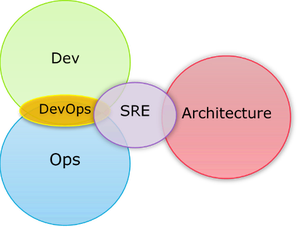

# DevOps-to-SRE
A personal list for DevOps and SRE tools, showcases and guides that I've used in production or plan to use soon. 

Self hosted tools that provide excellent external authentication integration will be used rather than SAAS ones, as larger organizations typically want to own their data and may have security requirements preventing the use of SAAS. SAAS only options will be marked as such.
The only cases this won't apply is where there's no reasonable self hosted alternative or the utility of the tool is that high that making a case for it could be considered.

## Existing awesome list
* [awesome-selfhosted](https://github.com/awesome-selfhosted/awesome-selfhosted)

# DevOps

* [What is DevOps?](https://theagileadmin.com/what-is-devops/)

## Existing awesome list

* [awesome-devsecops](https://github.com/TaptuIT/awesome-devsecops)

## Continuous Integration / Continuous Delivery (CI/CD)

* [Atlassian Bamboo](https://confluence.atlassian.com/bamboo/bamboo-documentation-289276551.html) (SAAS or on Prem, being deprecated in favour of SAAS Bitbucket pipelines)
    * [Bamboo YAML/Java Specs](https://docs.atlassian.com/bamboo-specs-docs/latest/)
* [Azure DevOps Pipelines](https://docs.microsoft.com/en-gb/azure/devops/pipelines/?view=azure-devops) (SAAS)
* [GitLab CI](https://docs.gitlab.com/ee/ci/) (SAAS or on Prem)
* [Jetbrains Teamcity](https://www.jetbrains.com/help/teamcity/teamcity-documentation.html)

## Config Managment

### Chef
* [Chef](https://docs.chef.io/)
#### Test Driven Development for Chef
* Integration Testing - [Test Kitchen](https://kitchen.ci/)
    * [Chef Docs](https://docs.chef.io/workstation/kitchen/)
* Unit Tests - [Rspec](https://docs.chef.io/workstation/chefspec/)
    * [repo](https://github.com/chefspec/chefspec)
    * [examples](https://github.com/chefspec/chefspec/tree/master/examples)
* Style/Linter - [Cookstyle](https://docs.chef.io/workstation/cookstyle/)
    * [repo](https://github.com/chef/cookstyle)

### Puppet

* [Puppet](https://puppet.com/docs/)

### Ansible

* [Ansible](https://docs.ansible.com/)

## Infrastucture As Code

### Terraform

#### Providers

* [aws-terraform-provider](https://registry.terraform.io/providers/hashicorp/aws/latest/docs)
    * [aws-terraform-provider-examples](https://github.com/hashicorp/terraform-provider-aws/tree/main/examples)
* [azure-terraform-provider](https://registry.terraform.io/providers/hashicorp/azurerm/latest/docs)
    * [azure-terraform-provider-examples](https://github.com/terraform-providers/terraform-provider-azurerm/tree/master/examples)
* [gcp-terraform-provider](https://registry.terraform.io/providers/hashicorp/google/latest/docs)
    * [gcp-terraform-provider-examples](https://github.com/hashicorp/terraform-provider-google/tree/master/examples)
* [oci-terraform-provider](https://registry.terraform.io/providers/hashicorp/oci/latest/docs)
    * [oci-terraform-provider-examples](https://github.com/terraform-providers/terraform-provider-oci)

#### Plugins and Utilites

* [Blast-Radius](https://github.com/28mm/blast-radius) - potentailly defunct, doesn't work for large scale projects
* [Infracost](https://infracost.io/) (SAAS) - Quite new, supports some AWS resources with more provider support coming soon
* [Terraform Visual](https://github.com/hieven/terraform-visual) - haven't tested in some time

#### Videos

* [Terraform in Regulated Financial Services](https://www.youtube.com/watch?v=DaqSQ59QNWw)

## Secrets Management

* [Hashicorp Vault](https://www.vaultproject.io/)
* [AWS Secrets Manager](https://docs.aws.amazon.com/secretsmanager/latest/userguide/intro.html)
* [Azure Key Vault](https://docs.microsoft.com/en-gb/azure/key-vault/)
* [GCP Secret Manager](https://cloud.google.com/secret-manager/docs)
* [OCI Vault](https://docs.oracle.com/en-us/iaas/Content/KeyManagement/Concepts/keyoverview.htm)

## Documentation Management

In my opinion engineers are most productive when documentation is kept as close to source code as possible.

* [BookStack](https://www.bookstackapp.com/) - not git compatible but you could set git up to pull into the source directory on a schedule
* [Gitbook](https://www.gitbook.com/) (SAAS)
* [MDBook](https://github.com/rust-lang/mdBook)

# Site Reliability Engineering (SRE)

* [What Is SRE?](https://www.redhat.com/en/topics/devops/what-is-sre)
* [Google SRE Books](https://sre.google/books/)
* [Google SRE Resources](https://sre.google/resources/)
* [Breaking down SRE/DevOps into 5 key areas](https://hernan-david-hd.medium.com/breaking-down-sre-devops-into-5-key-areas-5aacf40e8392)

## Existing awesome lists

* [awesome-sre](https://github.com/dastergon/awesome-sre)
* [how-they-sre](https://github.com/upgundecha/howtheysre)

## Monitoring & Alerting

* [Datadog](https://www.datadoghq.com/) (SAAS)
* [Prometheus](https://prometheus.io/), [Alertmanager](https://prometheus.io/docs/alerting/latest/alertmanager/) & [Grafana](https://grafana.com/oss/)
    * [Prometheus Exporters](https://prometheus.io/docs/instrumenting/exporters/)
* [Pager Duty](https://www.pagerduty.com/pricing/) (SAAS)
